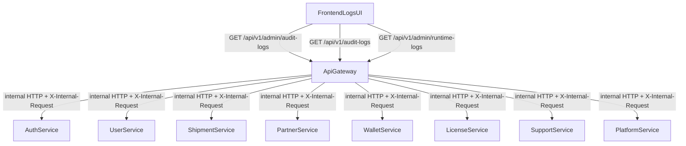

# Unified Audit + Runtime Logs (Backend→Frontend)

## Goals

- Provide **one place** to view:
- **Audit trail** (DB `AuditLog` rows across services)
- **Runtime logs** (Winston rotated log files)
- **Aggregation happens in API Gateway** (your choice) so the frontend only calls Gateway.
- Access rules (your choices):
- **Superadmin-only**: system-wide audit + runtime logs
- **Client**: audit logs scoped to their own `clientId` only (no runtime logs)

## High-level architecture

Key existing building blocks we’ll reuse:

- Runtime logging & rotation: [`shared/lib/logger.js`](shared/lib/logger.js)
- Gateway JWT context + internal secret propagation: [`backend/api-gateway/middleware/authValidator.js`](backend/api-gateway/middleware/authValidator.js)
- Gateway role/permission checks: [`backend/api-gateway/middleware/rbacChecker.js`](backend/api-gateway/middleware/rbacChecker.js)

## Backend plan

### 1) Standardize a cross-service response shape

Define a normalized “log event” contract returned by each backend service endpoint:

- **AuditEvent**: `{ id, service, timestamp, userId, clientId?, action, resource, resourceId?, ipAddress?, userAgent?, changes?, metadata? }`
- **RuntimeLogLine**: `{ service, file, line, parsed?: { timestamp, level, message } }`

This normalization happens **inside each service** so the Gateway doesn’t need to understand schema differences (e.g. partner-service uses `timestamp`, wallet uses `details`, etc.).

### 2) Add per-service admin endpoints (source of truth)

For each backend service under `backend/*-service/`, add:

- **Audit logs endpoint** (admin-grade): `GET /api/v1/admin/audit-logs`
- **Runtime logs endpoint** (tail only): `GET /api/v1/admin/runtime-logs`

Implementation requirements:

- **Controllers only** (no inline handlers) + **Joi validation** for query params.
- Enforce **admin-only** (service-side) using the service’s existing auth wrapper (e.g. [`backend/user-service/middleware/auth.js`](backend/user-service/middleware/auth.js)).
- Protect runtime log access:
- allow only `lines <= 500` (default 200)
- allow only known files (`YYYY-MM-DD.log`, `YYYY-MM-DD-error.log`)
- prevent path traversal
- scrub obvious secrets from output (Bearer tokens, passwords, API keys)

Files (pattern) per service:

- `controllers/adminLogsController.js`
- `routes/adminLogs.js`
- `validation/adminLogsSchemas.js`
- wire into `server.js` as `app.use('/api/v1/admin', adminLogsRoutes)`

Special cases discovered:

- `backend/platform-service/prisma/schema.prisma` and `backend/support-service/prisma/schema.prisma` currently **do not have an `AuditLog` model**. Options:
- **MVP**: audit endpoint returns empty list + runtime logs still work.
- **Complete** (recommended): add `AuditLog` model + migration to both services so future work can log properly.

### 3) Implement API Gateway aggregation endpoints

Add new Gateway routes (non-proxy logic) that call each service endpoint in parallel and merge results:

- **Superadmin-only (system-wide)**
- `GET /api/v1/admin/audit-logs`
- `GET /api/v1/admin/runtime-logs`
- **Client-scoped (tenant)**
- `GET /api/v1/audit-logs` (forces `clientId = req.user.clientId` server-side)

Implementation details:

- Add `backend/api-gateway/controllers/logsAggregationController.js` and `backend/api-gateway/routes/logs.js`.
- Gate access using [`requireRole`](backend/api-gateway/middleware/rbacChecker.js) (superadmin for `/admin/*`, client for `/audit-logs`).
- Use internal service URLs (`AUTH_SERVICE_URL`, `USER_SERVICE_URL`, etc.) and always forward `Authorization` + set `X-Internal-Request`.
- **Pagination approach** (robust): use a Gateway-level opaque `cursor` that contains per-service cursors; the Gateway requests the next page from each service and merges sorted by timestamp.

### 4) Swagger docs (minimum)

- Document Gateway endpoints in [`backend/api-gateway/config/swagger.js`](backend/api-gateway/config/swagger.js) so the UI can be tested easily.

## Frontend plan

### 5) Add a Logs UI page

Create a new page, reusing the existing dashboard layout pattern (see [`frontend/src/app/outlets/page.tsx`](frontend/src/app/outlets/page.tsx)):

- `frontend/src/app/audit-logs/page.tsx`

UI behavior:

- Tabs:
- **Audit Trail** (superadmin: system-wide; client: tenant-only)
- **Runtime Logs** (superadmin only)
- Filters for audit:
- service, date range, action, resource, userId, clientId (superadmin only), free-text search (client-side)
- Table + expandable JSON viewer for `changes/metadata`.

### 6) RTK Query endpoints

Add `frontend/src/store/api/endpoints/logsApi.ts`:

- `useGetAdminAuditLogsQuery` → `/api/v1/admin/audit-logs`
- `useGetClientAuditLogsQuery` → `/api/v1/audit-logs`
- `useGetAdminRuntimeLogsQuery` → `/api/v1/admin/runtime-logs`

### 7) Navigation

Update [`frontend/src/components/layout/sidebar.jsx`](frontend/src/components/layout/sidebar.jsx):

- Add **Audit Logs** menu item:
- roles: `['superadmin', 'client']`
- href: `/audit-logs`

## Verification checklist (Docker-first)

- For each touched backend service:
- `grep -r "require.*shared" backend/<service>/`
- restart containers (prefer monorepo commands where available)
- `docker exec logistics-<service> node -e "require('./server.js')"`
- check logs for `MODULE_NOT_FOUND`
- hit:
  - `GET /health`
  - `GET /api/v1/admin/audit-logs` (superadmin)
  - `GET /api/v1/admin/runtime-logs` (superadmin)
  - `GET /api/v1/audit-logs` (client)

## Implementation todos

- `spec-contracts`: Define normalized audit/runtime DTOs + query params + cursor strategy
- `service-endpoints`: Add per-service `/api/v1/admin/audit-logs` + `/api/v1/admin/runtime-logs`
