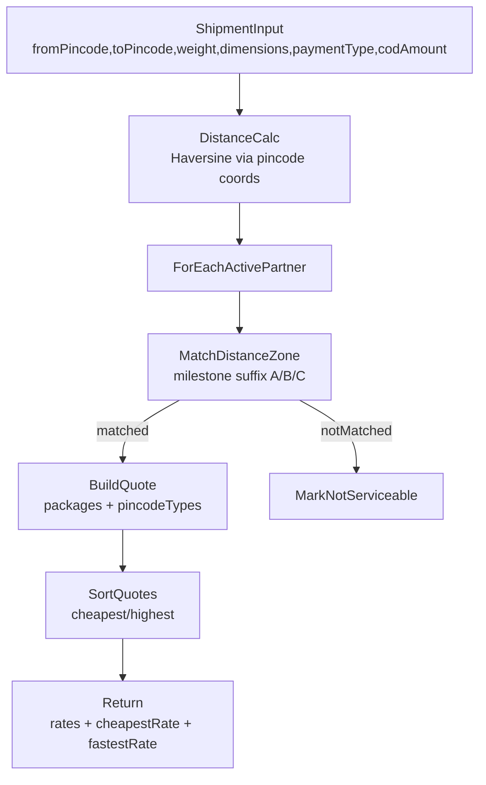

# Partner Service: Charge Packages + Zone-Based Charge Calculation

## Context (what we found)

- The **Zone System v2** is already implemented: Distance zones with milestones (`ZoneMilestone`), Pincode Types (`PincodeType` + assignments), and dual zone types (`ZoneType`). See: [backend/partner-service/services/distanceZoneService.js](backend/partner-service/services/distanceZoneService.js) and [backend/partner-service/prisma/schema.prisma](backend/partner-service/prisma/schema.prisma).
- Existing “packages/charges” code in partner-service (`/api/packages/*`, `packageService.js`, `chargeCalculationService.js`) is **legacy + external-micro-service driven** (no Prisma models), so it must be replaced for your new flow.
- Shipment-service currently calls **Partner Service** endpoints:
- `POST /api/partners/calculate`
- `POST /api/partners/serviceability`

via [backend/shipment-service/services/partnerIntegrationService.js](backend/shipment-service/services/partnerIntegrationService.js). We must keep response compatibility (notably `deliveryDays`).

## Confirmed requirements (from you)

- **Charge Packages are global per partner** (not per zone milestone).
- **Pincode Type charges apply to both pickup + delivery**, summing all active types.
- **GENERIC packages** are **flat now**, but we should keep a field for future calc types.
- `deliveryDays` should come from a **fixed per-partner field**.

## Target behavior

## Phase 0 — API Gateway routing (mandatory: gateway-only)

- Add API Gateway proxy for the new partner-service module:
- `GET/POST/PUT/DELETE /api/v1/charge-packages/*` → partner-service `/api/v1/charge-packages/*`
- Update: [backend/api-gateway/server.js](backend/api-gateway/server.js)
- Swagger aggregation already pulls partner-service OpenAPI from `http://partner-service:3005/openapi.json` and rewrites `servers` to gateway, so **no change expected** unless partner-service OpenAPI path changes.

## Phase 1 — Data model (Prisma)

- Add new models/enums to [backend/partner-service/prisma/schema.prisma](backend/partner-service/prisma/schema.prisma):
- `enum ChargePackageType { WEIGHT DISTANCE GENERIC }`
- `enum ChargePackageCalcType { FLAT PERCENTAGE_OF_COD PERCENTAGE_OF_DECLARED_VALUE }` (store but initially only use `FLAT`)
- `enum ChargePackageAppliesTo { ANY COD PREPAID }`
- `model ChargePackage` (UUID id) with:
- `partnerId` (CUID string)
- `name` (unique per partner)
- `type` (WEIGHT/DISTANCE/GENERIC)
- `baseCharge` (Decimal)
- `baseUnit` (Decimal, nullable; used for WEIGHT/DISTANCE)
- `addonUnit` (Decimal, nullable; used for WEIGHT/DISTANCE)
- `addonCharge` (Decimal, nullable; used for WEIGHT/DISTANCE)
- `appliesTo` (ANY/COD/PREPAID; relevant for GENERIC)
- `calcType` (default FLAT)
- `metadata` (Json? for future)
- `isActive`, `createdAt`, `updatedAt`
- Add `defaultDeliveryDays Int?` to `model Partner`.
- Create a migration under `backend/partner-service/prisma/migrations/*`.

## Phase 2 — Charge Package CRUD API (new flow)

- Create:
- [backend/partner-service/services/chargePackageService.js](backend/partner-service/services/chargePackageService.js)
- [backend/partner-service/controllers/chargePackageController.js](backend/partner-service/controllers/chargePackageController.js)
- [backend/partner-service/validation/chargePackageSchemas.js](backend/partner-service/validation/chargePackageSchemas.js)
- [backend/partner-service/routes/chargePackages.js](backend/partner-service/routes/chargePackages.js)
- Endpoints (all **function-based controllers**, no inline route logic):
- `POST /api/v1/charge-packages` body:
- `partnerIds: string[]` (single or many)
- `name, type, baseCharge`
- `baseUnit/addonUnit/addonCharge` required when type=WEIGHT/DISTANCE
- `appliesTo/calcType` used when type=GENERIC
- `GET /api/v1/charge-packages?partnerId=&type=&isActive=&search=&page=&limit=`
- `GET /api/v1/charge-packages/:id`
- `PUT /api/v1/charge-packages/:id`
- `DELETE /api/v1/charge-packages/:id` (soft delete: `isActive=false`)
- Audit logging (mandatory): write `AuditLog` entries on create/update/delete/bulk-create.

## Phase 3 — Replace rate + serviceability to use Zones + Packages

- Implement a new internal service, e.g.:
- [backend/partner-service/services/quoteCalculationService.js](backend/partner-service/services/quoteCalculationService.js)

### `POST /api/partners/serviceability`

- Replace current external/local rate-card logic in [backend/partner-service/controllers/partnerController.js](backend/partner-service/controllers/partnerController.js) (function `checkServiceability`).
- New logic:
- For each active partner (or a requested partner):
- Use [backend/partner-service/services/distanceZoneService.js](backend/partner-service/services/distanceZoneService.js) `getZoneForShipment(partnerId, fromPincode, toPincode)`.
- `isServiceable = matched === true`.
- Return the existing response shape (`{ serviceability: [...] }`).

### `POST /api/partners/calculate`

- Replace current external/local logic in `calculateRates`.
- New logic:
- Compute `distanceKm` once (or per partner via `getZoneForShipment`).
- Compute pincode type charges once:
- `pickupTypes = pincodeTypeService.getTypesByPincode(fromPincode)`
- `deliveryTypes = pincodeTypeService.getTypesByPincode(toPincode)`
- `pincodeTypeCharge = pickup.totalCharge + delivery.totalCharge` (active types only)
- For each serviceable partner:
- Load partner’s active `ChargePackage`s.
- Apply:
- **DISTANCE packages**: stepped formula with `baseUnit/addonUnit` against `distanceKm`.
- **WEIGHT packages**: stepped formula against `weight` (kg).
- **GENERIC packages**: include if `appliesTo` matches shipment paymentType.
- Add pincode type charge.
- Use partner’s `defaultDeliveryDays` as `deliveryDays`.
- Return per-partner quote with a **breakdown**.
- Add sorting support (cheapest/highest) while still returning:
- `rates`, `cheapestRate`, `fastestRate`.

## Phase 4 — Align routing + permissions (and remove inline route handlers)

- Update [backend/partner-service/routes/partners.js](backend/partner-service/routes/partners.js) to remove inline async handlers (mandatory rule) and call controller functions directly.
- Add a small middleware `requireAnyShipmentPermission` (partner-service local middleware) for calculate/serviceability to allow the many shipment-related scopes (`shipment:create:own|parent|assigned`, etc.) without hardcoding roles.

## Phase 5 — Deprecate legacy endpoints (minimal, non-breaking)

- Mark these legacy modules as deprecated (return `410 Gone` with guidance) instead of deleting immediately:
- `/api/packages/*` (external package charges)
- `/api/customer-charges/*`
- `/api/discounts/*`
- `/api/v1/charge-calculation/*`
- `/api/v1/partner-assignment/*`
- Update [backend/partner-service/server.js](backend/partner-service/server.js) and [backend/partner-service/config/swagger.js](backend/partner-service/config/swagger.js) accordingly.

## Phase 6 — Shipment-service compatibility fix (recommended)

- Update [backend/shipment-service/services/partnerIntegrationService.js](backend/shipment-service/services/partnerIntegrationService.js) so its calls to Partner Service include the required internal header:
- `X-Internal-Request: process.env.INTERNAL_SECRET`
- Forward the user’s `Authorization` header when calling Partner Service.

## Phase 7 — Frontend (RTK Query + Sidebar)

### Goal

- Keep using RTK Query via gateway base URL (already set in `API_CONFIG.BASE_URL`).
- Replace existing mock `/charges` UI with **Charge Packages** CRUD (WEIGHT/DISTANCE/GENERIC) and enable the sidebar entry.
- Access: **superadmin/admin/operations** only.

### RTK Query endpoints (new slice)

- Add: `frontend/src/store/api/endpoints/chargePackagesApi.ts`
- Endpoints (gateway-only):
- `GET /api/v1/charge-packages?partnerId=&type=&isActive=&search=&page=&limit=`
- `POST /api/v1/charge-packages` (multi-partner create with `partnerIds: []`)
- `GET /api/v1/charge-packages/:id`
- `PUT /api/v1/charge-packages/:id`
- `DELETE /api/v1/charge-packages/:id` (soft disable)

### Pages/components (reuse existing route)

- Reuse existing route and repurpose it to Charge Packages:
- `frontend/src/app/charges/page.jsx` → list + filters + disable/enable
- `frontend/src/app/charges/create/page.jsx` → create package form
- Partner selection should use the existing partners RTK query (`useGetPartnersQuery`) and allow selecting **single or multiple** partners.

### Sidebar unblock + naming

- Update: `frontend/src/components/layout/sidebar.jsx`
- Rename `"Charges Management"` → `"Charge Packages"`
- `disabled: false`
- Ensure roles include: `["superadmin","admin","operations"]`
- Align permission to the backend module/action used for `/charge-packages`

### Frontend cleanup (avoid duplicate API clients)

- Prefer RTK Query slices under `frontend/src/store/api/endpoints/*`.
- The legacy non-RTK wrapper `frontend/src/services/api/zones-api.ts` should not be used for the current flows (zones/pincode types already have RTK slices).

## Verification (what you’ll run after implementation)

- Restart services and check logs:
- `pnpm run dev:backend`
- `docker logs logistics-partner-service --tail=50`
- `docker logs logistics-partner-service | grep "MODULE_NOT_FOUND"`
- Health:
- `curl http://localhost:3001/api/v1/partner/health` (or gateway’s health routing)
- API smoke tests (via gateway):
- Create charge package (multi-partner)
- Create distance zone (already)
- `POST /api/partners/serviceability`
- `POST /api/partners/calculate` and confirm breakdown + sorting
- Verify gateway routing (no direct service calls from frontend):
- `GET http://localhost:3001/api/v1/charge-packages`
- Confirm `frontend/src/constants/api.ts` points to `NEXT_PUBLIC_API_BASE_URL=http://localhost:3001` in dev.

## Implementation todos

- **schema-charge-packages**: Add Prisma models/enums + Partner.defaultDeliveryDays and create migration
- **charge-packages-crud**: Implement service/controller/validation/routes for `/api/v1/charge-packages`
- **gateway-charge-packages-route**: Add API Gateway proxy for `/api/v1/charge-packages`
- **quote-engine**: Implement quoteCalculationService (distance+weight+generic+pincodeTypes)
- **partner-calc-endpoints**: Replace `/api/partners/calculate` and `/api/partners/serviceability` to use new quote engine
- **routes-no-inline**: Refactor touched routes to remove inline handlers