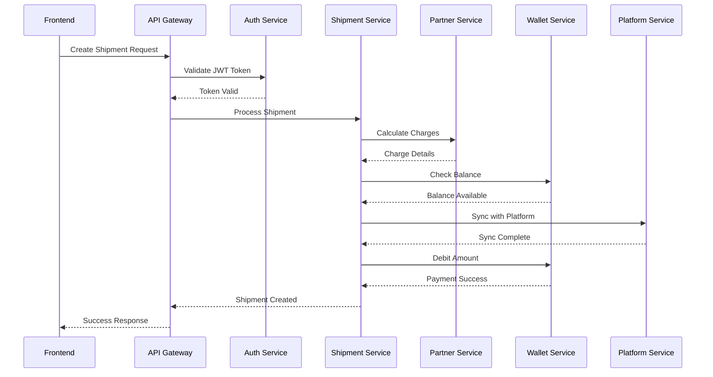
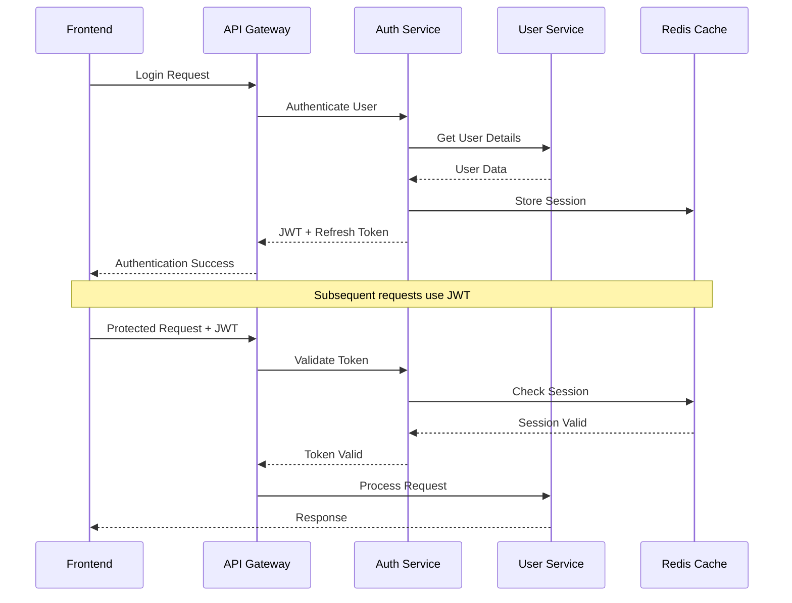
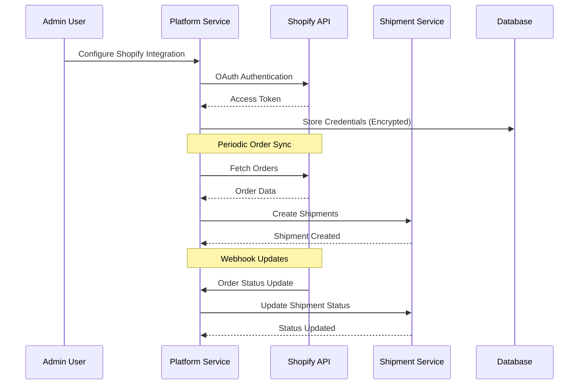

# Logistics Aggregator Portal - System Architecture

## Architecture Overview

This document provides detailed technical architecture for the Logistics Aggregator Portal, including microservices design, data flow, API specifications, and deployment strategy.

## Microservices Architecture

### Service Communication Patterns

**Synchronous Communication (REST APIs)**:

- Frontend to API Gateway
- Service-to-service direct calls
- External API integrations

**Asynchronous Communication (Future)**:

- Event-driven notifications
- Background job processing
- Webhook handling

### Service Registry

| Service          | Port | Technology | Purpose                              |
| ---------------- | ---- | ---------- | ------------------------------------ |
| API Gateway      | 8000 | Express.js | Request routing, auth, rate limiting |
| Auth Service     | 8001 | Express.js | Authentication, authorization        |
| User Service     | 8002 | Express.js | User management, client accounts     |
| Shipment Service | 8003 | Express.js | Order management, tracking           |
| Support Service  | 8004 | Express.js | Help desk, knowledge base            |
| Platform Service | 8005 | Express.js | E-commerce integrations              |
| Wallet Service   | 8006 | Existing   | Financial transactions               |
| Partner Service  | 8007 | Existing   | Courier charge calculations          |

## Data Flow Architecture

### 1. Shipment Creation Flow



### 2. User Authentication Flow



### 3. Platform Integration Flow



## API Specifications

### 1. Authentication Service APIs

#### POST /auth/login

```json
{
  "request": {
    "email": "user@example.com",
    "password": "secure_password",
    "remember": false
  },
  "response": {
    "status": "success",
    "data": {
      "accessToken": "jwt_token_here",
      "refreshToken": "refresh_token_here",
      "user": {
        "id": "uuid",
        "email": "user@example.com",
        "role": "admin",
        "clientId": "uuid"
      }
    }
  }
}
```

#### POST /auth/refresh

```json
{
  "request": {
    "refreshToken": "refresh_token_here"
  },
  "response": {
    "status": "success",
    "data": {
      "accessToken": "new_jwt_token",
      "refreshToken": "new_refresh_token"
    }
  }
}
```

### 2. Shipment Service APIs

#### POST /api/v1/shipments

```json
{
  "request": {
    "type": "single",
    "order": {
      "orderId": "ORD-12345",
      "platformOrderId": "SHOP-98765",
      "platformType": "shopify",
      "customerDetails": {
        "name": "John Doe",
        "phone": "+91-9876543210",
        "email": "john@example.com"
      },
      "pickupAddress": {
        "name": "Warehouse 1",
        "address": "123 Industrial Area",
        "city": "Mumbai",
        "state": "Maharashtra",
        "pincode": "400001",
        "phone": "+91-9876543210"
      },
      "deliveryAddress": {
        "name": "John Doe",
        "address": "456 Residential Area",
        "city": "Delhi",
        "state": "Delhi",
        "pincode": "110001",
        "phone": "+91-9876543210"
      },
      "packageDetails": {
        "weight": 1.5,
        "dimensions": {
          "length": 20,
          "width": 15,
          "height": 10
        },
        "value": 2500,
        "items": [
          {
            "name": "Product 1",
            "quantity": 2,
            "value": 1250
          }
        ]
      },
      "paymentType": "COD",
      "codAmount": 2500,
      "courierPreference": "cost"
    }
  },
  "response": {
    "status": "success",
    "data": {
      "shipmentId": "uuid",
      "awbNumber": "AWB123456789",
      "courierPartner": "Delhivery",
      "expectedDelivery": "2024-01-15",
      "trackingUrl": "https://track.logistics.com/AWB123456789",
      "charges": {
        "shippingCharge": 45.0,
        "gst": 8.1,
        "total": 53.1
      },
      "labelUrl": "https://labels.logistics.com/AWB123456789.pdf"
    }
  }
}
```

#### GET /api/v1/shipments/:id/tracking

```json
{
  "response": {
    "status": "success",
    "data": {
      "shipmentId": "uuid",
      "awbNumber": "AWB123456789",
      "currentStatus": "In Transit",
      "expectedDelivery": "2024-01-15",
      "trackingEvents": [
        {
          "status": "Manifested",
          "timestamp": "2024-01-10T10:30:00Z",
          "location": "Mumbai Hub",
          "description": "Package picked up"
        },
        {
          "status": "In Transit",
          "timestamp": "2024-01-11T14:20:00Z",
          "location": "Delhi Hub",
          "description": "Package in transit to Delhi"
        }
      ]
    }
  }
}
```

### 3. Platform Service APIs

#### POST /api/v1/platforms/shopify/connect

```json
{
  "request": {
    "shopDomain": "mystore.myshopify.com",
    "authCode": "authorization_code_from_shopify"
  },
  "response": {
    "status": "success",
    "data": {
      "integrationId": "uuid",
      "status": "connected",
      "shopDetails": {
        "name": "My Store",
        "domain": "mystore.myshopify.com",
        "email": "store@example.com"
      },
      "syncSettings": {
        "autoSync": true,
        "syncFrequency": "real-time",
        "orderStatuses": ["paid", "fulfilled"]
      }
    }
  }
}
```

### 4. User Service APIs

#### GET /api/v1/users/profile

```json
{
  "response": {
    "status": "success",
    "data": {
      "id": "uuid",
      "email": "user@example.com",
      "name": "John Doe",
      "role": "admin",
      "client": {
        "id": "uuid",
        "name": "ABC Logistics",
        "branding": {
          "logoUrl": "https://cdn.example.com/logo.png",
          "primaryColor": "#007bff",
          "trackingPageUrl": "https://abc-logistics.com/track"
        }
      },
      "permissions": [
        "shipment.create",
        "shipment.view",
        "wallet.access",
        "reports.access"
      ]
    }
  }
}
```

### 5. Wallet Service Integration APIs

#### GET /api/v1/wallet/balance

```json
{
  "response": {
    "status": "success",
    "data": {
      "userId": "uuid",
      "currentBalance": 15000.5,
      "currency": "INR",
      "lastUpdated": "2024-01-10T15:30:00Z"
    }
  }
}
```

#### POST /api/v1/wallet/debit

```json
{
  "request": {
    "amount": 53.1,
    "reference": "SHIP-uuid",
    "description": "Shipment charge for AWB123456789"
  },
  "response": {
    "status": "success",
    "data": {
      "transactionId": "uuid",
      "amount": 53.1,
      "newBalance": 14947.4,
      "timestamp": "2024-01-10T16:00:00Z"
    }
  }
}
```

## Database Design

### 1. Authentication Service Schema

```sql
-- Users table
CREATE TABLE users (
    id UUID PRIMARY KEY DEFAULT gen_random_uuid(),
    email VARCHAR(255) UNIQUE NOT NULL,
    password_hash VARCHAR(255) NOT NULL,
    role VARCHAR(50) NOT NULL CHECK (role IN ('admin', 'finance', 'operations', 'client', 'support')),
    client_id UUID REFERENCES clients(id),
    is_active BOOLEAN DEFAULT true,
    two_factor_enabled BOOLEAN DEFAULT false,
    two_factor_secret VARCHAR(255),
    created_at TIMESTAMP DEFAULT NOW(),
    updated_at TIMESTAMP DEFAULT NOW()
);

-- Sessions table
CREATE TABLE sessions (
    id UUID PRIMARY KEY DEFAULT gen_random_uuid(),
    user_id UUID REFERENCES users(id) ON DELETE CASCADE,
    refresh_token VARCHAR(500) NOT NULL,
    expires_at TIMESTAMP NOT NULL,
    ip_address INET,
    user_agent TEXT,
    created_at TIMESTAMP DEFAULT NOW()
);

-- Audit logs table
CREATE TABLE audit_logs (
    id UUID PRIMARY KEY DEFAULT gen_random_uuid(),
    user_id UUID REFERENCES users(id),
    action VARCHAR(100) NOT NULL,
    resource VARCHAR(100) NOT NULL,
    resource_id UUID,
    changes JSONB,
    ip_address INET,
    user_agent TEXT,
    created_at TIMESTAMP DEFAULT NOW()
);

-- Indexes
CREATE INDEX idx_users_email ON users(email);
CREATE INDEX idx_sessions_user_id ON sessions(user_id);
CREATE INDEX idx_sessions_expires_at ON sessions(expires_at);
CREATE INDEX idx_audit_logs_user_id ON audit_logs(user_id);
CREATE INDEX idx_audit_logs_created_at ON audit_logs(created_at);
```

### 2. Shipment Service Schema

```sql
-- Shipments table
CREATE TABLE shipments (
    id UUID PRIMARY KEY DEFAULT gen_random_uuid(),
    client_id UUID NOT NULL,
    user_id UUID NOT NULL,
    order_id VARCHAR(100) NOT NULL,
    platform_order_id VARCHAR(100),
    platform_type VARCHAR(50),
    awb_number VARCHAR(100) UNIQUE,
    courier_partner_id UUID,
    courier_partner_name VARCHAR(100),
    status VARCHAR(50) NOT NULL DEFAULT 'created',

    -- Customer details
    customer_name VARCHAR(255) NOT NULL,
    customer_phone VARCHAR(20) NOT NULL,
    customer_email VARCHAR(255),

    -- Addresses
    pickup_address JSONB NOT NULL,
    delivery_address JSONB NOT NULL,

    -- Package details
    weight DECIMAL(8,3) NOT NULL,
    dimensions JSONB, -- {length, width, height}
    declared_value DECIMAL(10,2) NOT NULL,
    package_items JSONB,

    -- Payment details
    payment_type VARCHAR(20) NOT NULL CHECK (payment_type IN ('COD', 'Prepaid')),
    cod_amount DECIMAL(10,2) DEFAULT 0,

    -- Shipping details
    shipping_charge DECIMAL(8,2),
    gst_amount DECIMAL(8,2),
    total_charge DECIMAL(8,2),

    -- Tracking
    tracking_data JSONB,
    expected_delivery DATE,
    actual_delivery_date DATE,

    -- Labels and documents
    label_url VARCHAR(500),
    manifest_url VARCHAR(500),
    invoice_url VARCHAR(500),

    created_at TIMESTAMP DEFAULT NOW(),
    updated_at TIMESTAMP DEFAULT NOW()
);

-- Tracking events table
CREATE TABLE tracking_events (
    id UUID PRIMARY KEY DEFAULT gen_random_uuid(),
    shipment_id UUID REFERENCES shipments(id) ON DELETE CASCADE,
    status VARCHAR(100) NOT NULL,
    status_code VARCHAR(20),
    location VARCHAR(255),
    timestamp TIMESTAMP NOT NULL,
    description TEXT,
    courier_data JSONB,
    created_at TIMESTAMP DEFAULT NOW()
);

-- Disputes table
CREATE TABLE disputes (
    id UUID PRIMARY KEY DEFAULT gen_random_uuid(),
    shipment_id UUID REFERENCES shipments(id),
    type VARCHAR(50) NOT NULL, -- weight_discrepancy, undelivered, damaged, lost
    status VARCHAR(50) NOT NULL DEFAULT 'open',
    description TEXT NOT NULL,
    evidence_urls TEXT[],
    resolution TEXT,
    created_by UUID NOT NULL,
    assigned_to UUID,
    resolved_at TIMESTAMP,
    created_at TIMESTAMP DEFAULT NOW(),
    updated_at TIMESTAMP DEFAULT NOW()
);

-- Indexes
CREATE INDEX idx_shipments_client_id ON shipments(client_id);
CREATE INDEX idx_shipments_order_id ON shipments(order_id);
CREATE INDEX idx_shipments_awb_number ON shipments(awb_number);
CREATE INDEX idx_shipments_status ON shipments(status);
CREATE INDEX idx_shipments_created_at ON shipments(created_at);
CREATE INDEX idx_tracking_events_shipment_id ON tracking_events(shipment_id);
CREATE INDEX idx_tracking_events_timestamp ON tracking_events(timestamp);
```

### 3. Platform Service Schema

```sql
-- Platform integrations table
CREATE TABLE platform_integrations (
    id UUID PRIMARY KEY DEFAULT gen_random_uuid(),
    client_id UUID NOT NULL,
    user_id UUID NOT NULL,
    platform_type VARCHAR(50) NOT NULL, -- shopify, woocommerce, magento
    platform_domain VARCHAR(255) NOT NULL,

    -- Encrypted credentials
    credentials JSONB NOT NULL, -- {api_key, secret_key, access_token}

    -- Integration settings
    settings JSONB NOT NULL, -- {auto_sync, sync_frequency, order_statuses}

    -- Status
    status VARCHAR(50) NOT NULL DEFAULT 'active', -- active, inactive, error
    last_sync_at TIMESTAMP,
    sync_error TEXT,

    created_at TIMESTAMP DEFAULT NOW(),
    updated_at TIMESTAMP DEFAULT NOW()
);

-- Platform orders table (for sync tracking)
CREATE TABLE platform_orders (
    id UUID PRIMARY KEY DEFAULT gen_random_uuid(),
    integration_id UUID REFERENCES platform_integrations(id),
    platform_order_id VARCHAR(100) NOT NULL,
    order_data JSONB NOT NULL,
    sync_status VARCHAR(50) NOT NULL DEFAULT 'pending', -- pending, synced, error
    shipment_id UUID,
    error_message TEXT,
    created_at TIMESTAMP DEFAULT NOW(),
    synced_at TIMESTAMP
);

-- Indexes
CREATE INDEX idx_platform_integrations_client_id ON platform_integrations(client_id);
CREATE INDEX idx_platform_orders_integration_id ON platform_orders(integration_id);
CREATE INDEX idx_platform_orders_platform_order_id ON platform_orders(platform_order_id);
```

## Security Implementation

### 1. Authentication Middleware

```javascript
const jwt = require("jsonwebtoken");
const redis = require("redis");

class AuthMiddleware {
  static async verifyToken(req, res, next) {
    try {
      const token = req.header("Authorization")?.replace("Bearer ", "");

      if (!token) {
        return res.status(401).json({
          status: "error",
          message: "Access denied. No token provided.",
        });
      }

      // Verify JWT
      const decoded = jwt.verify(token, process.env.JWT_SECRET);

      // Check if session exists in Redis
      const session = await redis.get(`session:${decoded.userId}`);
      if (!session) {
        return res.status(401).json({
          status: "error",
          message: "Invalid session.",
        });
      }

      req.user = decoded;
      next();
    } catch (error) {
      res.status(401).json({
        status: "error",
        message: "Invalid token.",
      });
    }
  }

  static authorize(permissions) {
    return (req, res, next) => {
      const userPermissions = req.user.permissions || [];

      const hasPermission = permissions.every((permission) =>
        userPermissions.includes(permission)
      );

      if (!hasPermission) {
        return res.status(403).json({
          status: "error",
          message: "Insufficient permissions.",
        });
      }

      next();
    };
  }
}
```

### 2. Input Validation

```javascript
const Joi = require("joi");

const shipmentSchema = Joi.object({
  orderId: Joi.string().required().max(100),
  customerDetails: Joi.object({
    name: Joi.string().required().max(255),
    phone: Joi.string()
      .required()
      .pattern(/^\+91-[0-9]{10}$/),
    email: Joi.string().email().optional(),
  }).required(),
  pickupAddress: Joi.object({
    name: Joi.string().required(),
    address: Joi.string().required(),
    city: Joi.string().required(),
    state: Joi.string().required(),
    pincode: Joi.string()
      .required()
      .pattern(/^[0-9]{6}$/),
    phone: Joi.string().required(),
  }).required(),
  // ... additional validations
});

const validateShipment = (req, res, next) => {
  const { error } = shipmentSchema.validate(req.body);
  if (error) {
    return res.status(400).json({
      status: "error",
      message: "Validation error",
      details: error.details,
    });
  }
  next();
};
```

### 3. Rate Limiting

```javascript
const rateLimit = require("express-rate-limit");
const RedisStore = require("rate-limit-redis");

const createRateLimiter = (windowMs, max) => {
  return rateLimit({
    store: new RedisStore({
      client: redis,
      prefix: "rl:",
    }),
    windowMs,
    max,
    message: {
      status: "error",
      message: "Too many requests, please try again later.",
    },
    standardHeaders: true,
    legacyHeaders: false,
  });
};

// Different limits for different endpoints
const authLimiter = createRateLimiter(15 * 60 * 1000, 5); // 5 attempts per 15 minutes
const apiLimiter = createRateLimiter(15 * 60 * 1000, 100); // 100 requests per 15 minutes
const bulkLimiter = createRateLimiter(60 * 60 * 1000, 10); // 10 bulk operations per hour
```

## Deployment Configuration

### 1. Docker Configuration

#### Dockerfile for Node.js Services

```dockerfile
FROM node:18-alpine

WORKDIR /app

# Copy package files
COPY package*.json ./

# Install dependencies
RUN npm install -g pnpm@8.15.1 && pnpm install --prod --frozen-lockfile

# Copy source code
COPY . .

# Create non-root user
RUN addgroup -g 1001 -S nodejs
RUN adduser -S nodejs -u 1001

# Change ownership
RUN chown -R nodejs:nodejs /app

USER nodejs

EXPOSE 8000

CMD ["node", "server.js"]
```

#### Docker Compose Configuration

```yaml
version: "3.8"

services:
  api-gateway:
    build:
      context: ./api-gateway
    ports:
      - "8000:8000"
    environment:
      - NODE_ENV=production
      - JWT_SECRET=${JWT_SECRET}
      - REDIS_URL=${REDIS_URL}
    depends_on:
      - redis
      - postgres

  auth-service:
    build:
      context: ./auth-service
    ports:
      - "8001:8001"
    environment:
      - NODE_ENV=production
      - DATABASE_URL=${AUTH_DATABASE_URL}
      - JWT_SECRET=${JWT_SECRET}
      - REDIS_URL=${REDIS_URL}
    depends_on:
      - postgres
      - redis

  shipment-service:
    build:
      context: ./shipment-service
    ports:
      - "8003:8003"
    environment:
      - NODE_ENV=production
      - DATABASE_URL=${SHIPMENT_DATABASE_URL}
      - WALLET_SERVICE_URL=${WALLET_SERVICE_URL}
      - PARTNER_SERVICE_URL=${PARTNER_SERVICE_URL}
    depends_on:
      - postgres

  postgres:
    image: postgres:15-alpine
    environment:
      - POSTGRES_DB=logistics
      - POSTGRES_USER=${DB_USER}
      - POSTGRES_PASSWORD=${DB_PASSWORD}
    volumes:
      - postgres_data:/var/lib/postgresql/data
      - ./init.sql:/docker-entrypoint-initdb.d/init.sql
    ports:
      - "5432:5432"

  redis:
    image: redis:7-alpine
    command: redis-server --appendonly yes
    volumes:
      - redis_data:/data
    ports:
      - "6379:6379"

  nginx:
    image: nginx:alpine
    ports:
      - "80:80"
      - "443:443"
    volumes:
      - ./nginx.conf:/etc/nginx/nginx.conf
      - ./ssl:/etc/nginx/ssl
    depends_on:
      - api-gateway

volumes:
  postgres_data:
  redis_data:
```

### 2. Nginx Configuration

```nginx
upstream api_backend {
    server api-gateway:8000;
}

server {
    listen 80;
    server_name logistics.example.com;
    return 301 https://$server_name$request_uri;
}

server {
    listen 443 ssl http2;
    server_name logistics.example.com;

    ssl_certificate /etc/nginx/ssl/logistics.crt;
    ssl_certificate_key /etc/nginx/ssl/logistics.key;

    # Security headers
    add_header X-Frame-Options DENY;
    add_header X-Content-Type-Options nosniff;
    add_header X-XSS-Protection "1; mode=block";
    add_header Strict-Transport-Security "max-age=31536000; includeSubDomains" always;

    # API routes
    location /api/ {
        proxy_pass http://api_backend;
        proxy_set_header Host $host;
        proxy_set_header X-Real-IP $remote_addr;
        proxy_set_header X-Forwarded-For $proxy_add_x_forwarded_for;
        proxy_set_header X-Forwarded-Proto $scheme;

        # Timeouts
        proxy_connect_timeout 30s;
        proxy_send_timeout 30s;
        proxy_read_timeout 30s;
    }

    # Frontend static files
    location / {
        root /var/www/html;
        try_files $uri $uri/ /index.html;
    }
}
```

## Monitoring and Logging

### 1. Application Logging

```javascript
const winston = require("winston");
const { ElasticsearchTransport } = require("winston-elasticsearch");

const logger = winston.createLogger({
  level: "info",
  format: winston.format.combine(
    winston.format.timestamp(),
    winston.format.errors({ stack: true }),
    winston.format.json()
  ),
  defaultMeta: {
    service: process.env.SERVICE_NAME,
    version: process.env.SERVICE_VERSION,
  },
  transports: [
    new winston.transports.File({
      filename: "logs/error.log",
      level: "error",
    }),
    new winston.transports.File({
      filename: "logs/combined.log",
    }),
  ],
});

if (process.env.NODE_ENV !== "production") {
  logger.add(
    new winston.transports.Console({
      format: winston.format.simple(),
    })
  );
}

// Request logging middleware
const requestLogger = (req, res, next) => {
  logger.info("Request received", {
    method: req.method,
    url: req.url,
    ip: req.ip,
    userAgent: req.get("User-Agent"),
    userId: req.user?.id,
  });

  const start = Date.now();

  res.on("finish", () => {
    const duration = Date.now() - start;
    logger.info("Request completed", {
      method: req.method,
      url: req.url,
      statusCode: res.statusCode,
      duration: `${duration}ms`,
      userId: req.user?.id,
    });
  });

  next();
};
```

### 2. Health Check Endpoints

```javascript
// Health check router
const healthRouter = express.Router();

healthRouter.get("/health", async (req, res) => {
  const health = {
    status: "ok",
    timestamp: new Date().toISOString(),
    uptime: process.uptime(),
    checks: {},
  };

  try {
    // Database check
    await db.query("SELECT 1");
    health.checks.database = "ok";
  } catch (error) {
    health.checks.database = "error";
    health.status = "error";
  }

  try {
    // Redis check
    await redis.ping();
    health.checks.redis = "ok";
  } catch (error) {
    health.checks.redis = "error";
    health.status = "error";
  }

  const statusCode = health.status === "ok" ? 200 : 503;
  res.status(statusCode).json(health);
});

healthRouter.get("/metrics", (req, res) => {
  res.json({
    memory: process.memoryUsage(),
    uptime: process.uptime(),
    timestamp: new Date().toISOString(),
  });
});
```

This comprehensive system architecture provides the foundation for building a robust, scalable logistics aggregator portal that meets all the requirements outlined in the PRD.
