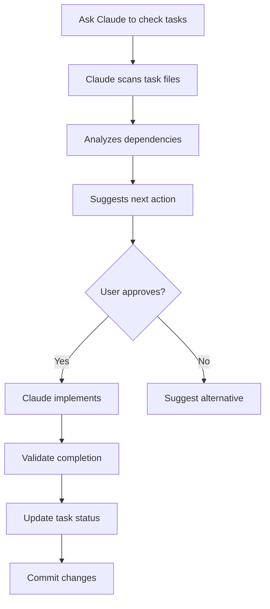

# Development Workflow Guide

## Auto-Detection & Task Management

This project uses an intelligent task management system that automatically detects available tasks and suggests next actions.

## Quick Commands

### Check Available Tasks

```bash
# Run the task checker
./scripts/check-tasks.sh

# Or ask Claude directly:
# "Check for available tasks"
# "What should I work on next?"
# "Show me pending tasks"
```

### Auto-Start Implementation

```bash
# Ask Claude to start any task:
# "Start implementing GATE-001"
# "Begin frontend migration"
# "Start the next available P0 task"
```

## How Auto-Detection Works

### 1. Task Scanning

The system automatically scans:

- `backend/BACKEND_GATEWAY_TASK.md`
- `frontend/FRONTEND_ARCHITECTURE_TASK.md`
- Task status (NOT_STARTED, IN_PROGRESS, COMPLETED)
- Priority levels (P0, P1, P2)
- Dependencies and blockers

### 2. Intelligent Suggestions

Claude will analyze:

- ✅ Which tasks are ready to start (dependencies met)
- 🔴 Critical P0 tasks that must be done first
- 🟡 Currently in-progress tasks
- 🟢 Recently completed tasks
- 📊 Overall progress percentage

### 3. Smart Implementation

When you ask to start a task, Claude will:

- ✅ Verify all dependencies are met
- ✅ Show you the implementation plan
- ✅ Execute the task step-by-step
- ✅ Validate completion before marking done
- ✅ Update task status automatically

## Example Workflows

### Workflow 1: Check and Start

```bash
You: "Check for available tasks"

Claude: [Shows task status dashboard]
- 🔴 GATE-001: Remove external ports (READY TO START)
- 🔴 GATE-002: Add internal validation (BLOCKED by GATE-001)
- Backend Progress: 0/8 (0%)

You: "Start implementing GATE-001"

Claude: [Executes task]
1. Backing up docker-compose.yml
2. Removing service ports
3. Testing isolation
4. Updating task status
```

### Workflow 2: Continue Work

```bash
You: "What's currently in progress?"

Claude: [Shows active tasks]
- 🟡 GATE-002: Add internal validation (IN_PROGRESS)
- Implementation at 60%
- Next steps: Add validation to remaining 3 services

You: "Continue GATE-002"

Claude: [Resumes from last checkpoint]
```

### Workflow 3: Sprint Overview

```bash
You: "Show me sprint progress"

Claude: [Complete dashboard]
Sprint: Day 3 of 14
Backend: 3/8 completed (37.5%)
Frontend: 1/10 completed (10%)
Blockers: None
Next Critical: GATE-003 (JWT validation)
```

## Task Status Indicators

| Indicator         | Meaning                       | Action                  |
| ----------------- | ----------------------------- | ----------------------- |
| 🔴 P0 NOT_STARTED | Critical task, ready to start | "Start GATE-001"        |
| 🟡 IN_PROGRESS    | Currently being worked on     | "Continue GATE-002"     |
| 🟢 COMPLETED      | Finished and validated        | Review only             |
| ⏸️ BLOCKED        | Waiting on dependencies       | Complete blockers first |
| ⚠️ P1/P2          | Lower priority                | Start after P0 tasks    |

## Natural Language Commands

### Task Discovery

- "What tasks are available?"
- "Show me the next task"
- "What should I work on next?"
- "Check task status"
- "Show sprint progress"

### Starting Tasks

- "Start GATE-001"
- "Begin the next P0 task"
- "Implement frontend migration"
- "Start implementing [task-name]"

### Task Management

- "Mark GATE-001 as complete"
- "Show dependencies for FE-002"
- "What's blocking GATE-003?"
- "Update task status"

### Progress Tracking

- "Show completed tasks"
- "What percentage is done?"
- "Sprint progress report"
- "Show task dependencies"

## Integration with PRD

The system automatically links to:

- **PRD**: `docs/PRD_API_GATEWAY_RBAC.md`
- **Backend Tasks**: `backend/BACKEND_GATEWAY_TASK.md`
- **Frontend Tasks**: `frontend/FRONTEND_ARCHITECTURE_TASK.md`
- **Active Context**: `memory-bank/activeContext.md`
- **Progress Tracker**: `memory-bank/progress.md`

## Validation Before Completion

Claude will automatically validate:

- ✅ All subtasks completed
- ✅ Code compiles/runs without errors
- ✅ Docker services restart successfully
- ✅ Tests passing
- ✅ Documentation updated
- ✅ Dependencies unblocked

## Task Update Flow



## Current Sprint Tasks

### Phase 1: Critical Security (P0)

1. **GATE-001**: Remove external service ports ⏳ READY
2. **GATE-002**: Add internal request validation ⏸️ BLOCKED
3. **GATE-003**: Implement gateway JWT validation ⏸️ BLOCKED

### Phase 2: Frontend Migration (P0)

1. **FE-001**: Remove direct service URLs ⏳ READY (parallel with GATE-001)
2. **FE-002**: Setup Redux/RTK Query ⏸️ BLOCKED by FE-001
3. **FE-003**: Implement auth flow ⏸️ BLOCKED by FE-002

### Phase 3: Documentation (P1)

1. **SWAG-001**: Remove Swagger UI from services ⏸️ BLOCKED by GATE-002
2. **SWAG-002**: Gateway Swagger aggregation ⏸️ BLOCKED by SWAG-001

## Best Practices

### 1. Always Check First

Before starting any work:

```bash
"Check for available tasks"
```

### 2. Follow Dependencies

Don't skip ahead:

```bash
# ❌ Bad
"Start GATE-003"  # GATE-002 not complete

# ✅ Good
"Start GATE-001"  # First in sequence
```

### 3. Validate Completion

After finishing a task:

```bash
"Validate GATE-001 completion"
```

### 4. Update Documentation

Task status is automatically updated in:

- Task markdown files
- Memory bank
- Progress tracker

## Troubleshooting

### "Task is blocked"

**Solution**: Check dependencies in task file, complete blockers first

### "Can't find task"

**Solution**: Run `./scripts/check-tasks.sh` to see all available tasks

### "Implementation failed"

**Solution**: Claude will automatically rollback changes and mark task as IN_PROGRESS with notes

## Command Reference

### Script Commands

```bash
# Check all tasks
./scripts/check-tasks.sh

# Check with auto-start mode
./scripts/check-tasks.sh --start
```

### Claude Commands

```bash
# Just ask naturally:
"Check tasks"
"Start next task"
"Show progress"
"Mark task complete"
"What's blocking?"
```

## Notes

- All task updates are automatically committed to git
- Progress is tracked in real-time
- Dependencies are enforced
- Validation is mandatory before completion
- Rollback capability for all changes

---

**Tip**: You can always ask Claude in natural language. The system understands context and will guide you through the implementation process!
