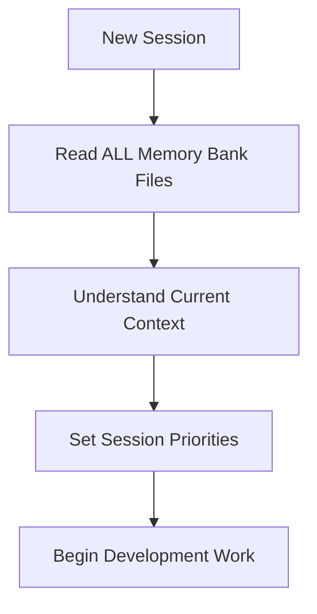
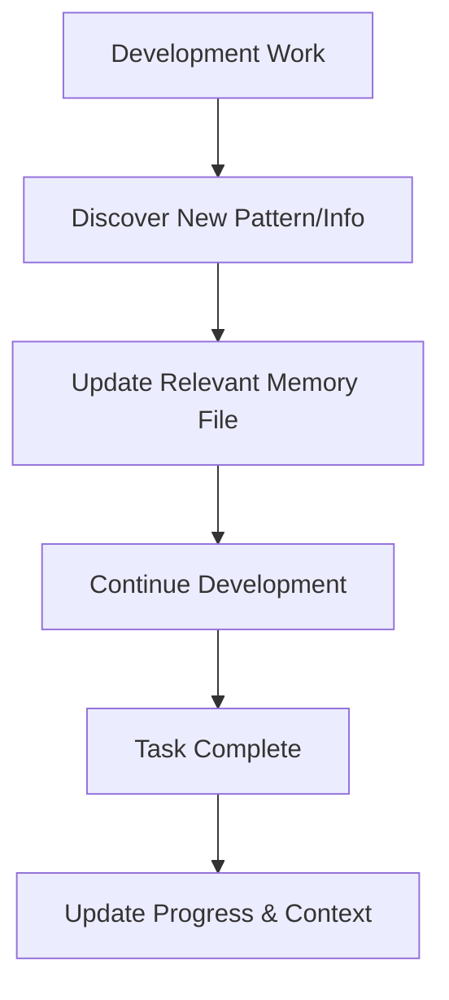
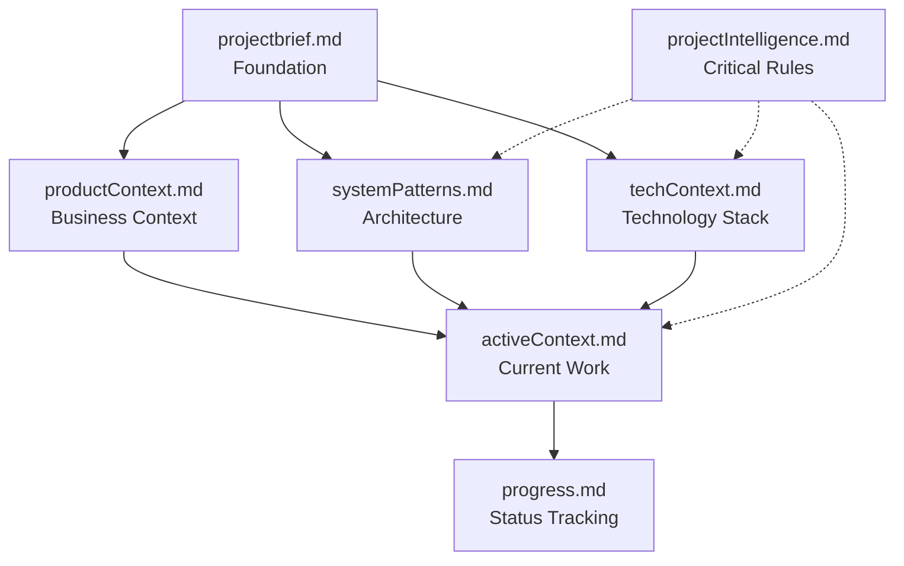

# Memory Bank - Project Context & Intelligence

## Purpose

This Memory Bank preserves project context, patterns, and intelligence across development sessions. Since my memory resets between sessions, these files serve as my **complete project knowledge base**.

## Memory Bank Structure

### Core Files (Required - Read Every Session)

#### 1. `projectbrief.md` - **Foundation Document**

- **Purpose**: Defines project scope, requirements, and success criteria
- **Contains**: Business goals, technical architecture, user roles, timeline, budget
- **Role**: Source of truth for all project decisions and priorities
- **When to Update**: When project scope or requirements change

#### 2. `productContext.md` - **Business Context**

- **Purpose**: Explains why this project exists and what problems it solves
- **Contains**: Market analysis, user journeys, value propositions, competitive advantages
- **Role**: Provides business rationale for technical decisions
- **When to Update**: When market research or user feedback changes direction

#### 3. `activeContext.md` - **Current Work Focus**

- **Purpose**: Tracks current work, recent changes, and immediate priorities
- **Contains**: Current sprint goals, blockers, recent accomplishments, next actions
- **Role**: Session startup guide and priority setting
- **When to Update**: After major completions or when priorities shift

#### 4. `systemPatterns.md` - **Architecture Intelligence**

- **Purpose**: Documents architectural patterns, design decisions, and code standards
- **Contains**: Microservices patterns, database designs, integration approaches, testing strategies
- **Role**: Technical implementation guide and consistency enforcement
- **When to Update**: When new patterns are established or architectures evolve

#### 5. `techContext.md` - **Technology Stack**

- **Purpose**: Comprehensive technology overview and implementation details
- **Contains**: Frameworks, libraries, tools, configurations, development workflows
- **Role**: Technical reference and development environment guide
- **When to Update**: When technology choices change or new tools are adopted

#### 6. `progress.md` - **Project Status Tracking**

- **Purpose**: Detailed tracking of what's built, what works, and what's left
- **Contains**: Feature completion status, testing results, deployment status, success metrics
- **Role**: Progress assessment and milestone tracking
- **When to Update**: After significant feature completions or phase transitions

### Intelligence Files (Project-Specific)

#### `projectIntelligence.md` - **Critical Patterns & Rules**

- **Purpose**: Stores project-specific rules, patterns, and critical decisions
- **Contains**: Mandatory patterns (like "Always use Prisma ORM"), coding standards, architectural rules
- **Role**: Enforcement of project consistency and quality standards
- **When to Update**: When new critical patterns are established or rules change

## Memory Bank Usage Workflow

### Session Startup (MANDATORY)



### During Development



### Memory Bank Maintenance

```mermaid
flowchart TD
    Trigger{Update Trigger}
    Trigger --> Major[Major Feature Complete]
    Trigger --> Request[User Requests "Update Memory Bank"]
    Trigger --> Pattern[New Pattern Discovered]

    Major --> Review[Review ALL Files]
    Request --> Review
    Pattern --> Specific[Update Specific File]

    Review --> UpdateAll[Update All Relevant Files]
    Specific --> Verify[Verify Consistency]
    UpdateAll --> Verify
    Verify --> Complete[Memory Bank Updated]
```

## File Hierarchy & Dependencies



## Memory Bank Quality Standards

### Content Requirements

- **Comprehensive**: Each file must be self-contained and complete
- **Current**: Information must reflect the latest project state
- **Actionable**: Provide clear guidance for development decisions
- **Consistent**: Maintain consistency across all files
- **Searchable**: Use clear headings and structure for quick reference

### Update Triggers

1. **Major Feature Completion**: Update progress.md and activeContext.md
2. **Architecture Changes**: Update systemPatterns.md and techContext.md
3. **Requirement Changes**: Update projectbrief.md and productContext.md
4. **New Patterns Discovered**: Update projectIntelligence.md
5. **User Request**: Review and update all relevant files

### Maintenance Schedule

- **Every Session**: Read all core files
- **After Major Changes**: Update affected files immediately
- **Weekly**: Review consistency across all files
- **Phase Completion**: Comprehensive review and update of all files

## Current Memory Bank Status

### ✅ Complete and Current Files

- **projectbrief.md**: ✅ Comprehensive project foundation
- **productContext.md**: ✅ Business context and market analysis
- **activeContext.md**: ✅ Current work focus and recent changes
- **systemPatterns.md**: ✅ Architecture patterns and design decisions
- **techContext.md**: ✅ Complete technology stack and tools
- **progress.md**: ✅ Detailed progress tracking and status
- **projectIntelligence.md**: ✅ Critical patterns and rules
- **README.md**: ✅ Memory bank documentation

### 🎯 Memory Bank Health

**Status**: ✅ **Complete and Fully Operational**

- **Coverage**: All required files present and comprehensive
- **Currency**: All files reflect latest project state (January 2025)
- **Consistency**: Information is consistent across files
- **Completeness**: Sufficient detail for development guidance
- **Infrastructure Status**: ALL 9 services operational with zero issues
- **AI Guidance**: Complete Cursor Rules system implemented

## Usage Guidelines

### For Development Sessions

1. **Always Start Here**: Read all core files before beginning work
2. **Reference Frequently**: Consult relevant files during development
3. **Update Immediately**: Update files when new patterns emerge
4. **Maintain Quality**: Ensure updates maintain consistency and completeness

### For Project Continuity

- **Decision Making**: Use projectbrief.md and productContext.md for business decisions
- **Technical Implementation**: Use systemPatterns.md and techContext.md for technical guidance
- **Priority Setting**: Use activeContext.md and progress.md for work planning
- **Quality Assurance**: Use projectIntelligence.md for consistency enforcement

### For Team Collaboration

- **Onboarding**: New team members should read all memory bank files
- **Context Sharing**: Memory bank provides shared understanding
- **Decision Documentation**: All major decisions should be documented
- **Pattern Sharing**: Successful patterns should be captured for reuse

---

**Memory Bank Status**: ✅ **Complete and Fully Operational**  
**Last Updated**: January 2025  
**Current Phase**: Infrastructure 100% Complete - Maximum Development Velocity  
**Next Priority**: Feature Development on Fully Operational Foundation with AI Guidance
